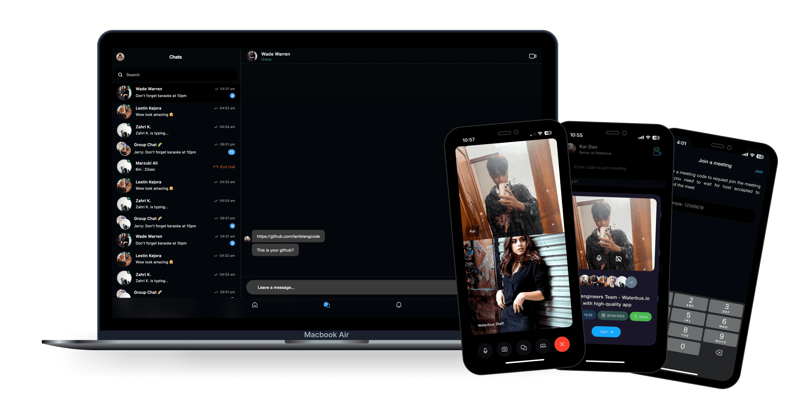
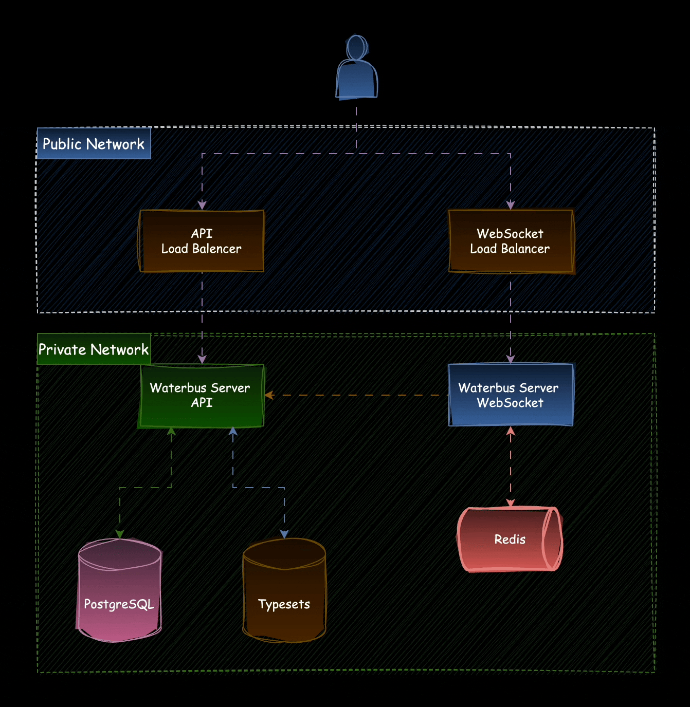
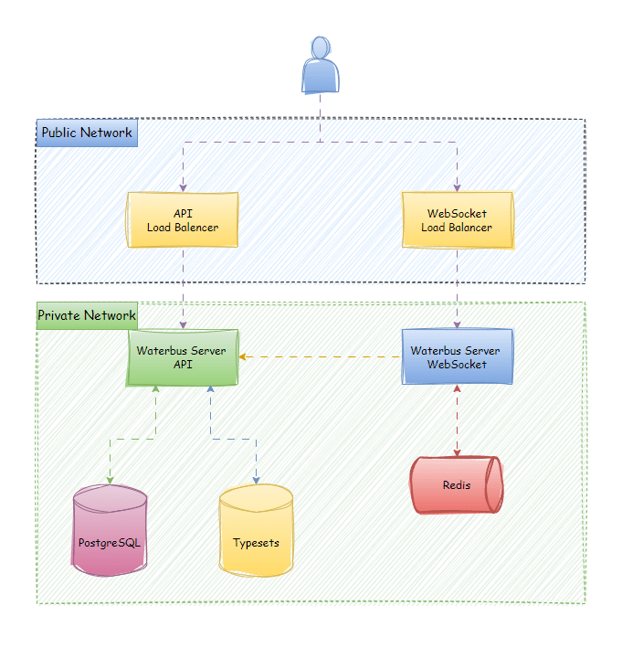

> [!IMPORTANT]  
> Waterbus SFU WebSocket is migration to v2.


<h2 align="center">Waterbus Server SFU WebSocket</h2>
<div class="badges" align="center">
<p><a href="https://codecov.io/gh/waterbustech/waterbus"></a><a href="https://www.codefactor.io/repository/github/waterbustech/waterbus"></a><a href="https://chromium.googlesource.com/external/webrtc/+/branch-heads/6099"></a><a href="https://github.com/lambiengcode"></a></p>
</div>
<div align="center">
<a href="https://twitter.com/waterbustech"></a><a href="https://discord.gg/mfrWVefU"></a>
</div>
<p align="center">
  <a href="https://docs.waterbus.tech">Website</a> &bull;
  <a href="https://github.com/waterbustech/waterbus/wiki">Wiki</a> &bull;
  <a href="https://github.com/waterbustech/waterbus/blob/main/LICENSE">License</a>
</p>

## 📗 Table of Contents
- [📗 Table of Contents](#-table-of-contents)
- [👋 Introduction](#-introduction)
  - [🛠️ Arch Design](#️-arch-design)
  - [🔥 WebRTC SFU](#-webrtc-sfu)
  - [💨 SFU performance](#-sfu-performance)
  - [✨ Features](#-features)
- [🚀 Quick run](#-quick-run)
  - [👇 Requirements](#-requirements)
- [🔗 Links](#-links)

## 👋 Introduction

- 🤙 Waterbus is open source video conferencing multiplatform app built on latest WebRTC SDK. This is server api for the application. 
- 🎯 Waterbus aims for scalability and low latency as well as self-hosted and offers many useful features for everyday interviews or meetings.

### 🛠️ Arch Design

[](https://docs.waterbus.tech#gh-dark-mode-only)
[](https://docs.waterbus.tech#gh-light-mode-only)

### 🔥 WebRTC SFU

<div align="center">


</div>

At times, the term is used to describe a type of video routing device, while at other times it will be used to indicate the support of routing technology and not a specific device. An SFU is a media server component capable of receiving multiple media streams and then deciding which of these media streams should be sent to which participants. Its main use is in supporting group calls and live streaming/broadcast scenarios.

- In this case, each participant still sends just one set of video and audio up to the SFU, like our MCU. However, the SFU doesn’t make any composite streams. Rather, it sends a different stream down for each user. In this example, 4 streams are received by each participant, since there are 5 people in the call.
- The good thing about this is it’s still less work on each participant than a mesh peer-to-peer model. This is because each participant is only establishing one connection (to the SFU) instead of to all other participants to upload their own video/audio. But, it can be more bandwidth intensive than the MCU because the participants each receive multiple streams downloaded.
- The nice thing for participants about receiving separate streams is that they can do whatever they want with them. They are not bound to layout or UI decisions of the MCU. If you have been in a conference call where the conferencing tool allowed you to choose a different layout (ie, which speaker’s video will be most prominent, or how you want to arrange the videos on the screen), then that was using an SFU.
- Media servers which implement an SFU architecture include Jitsi and Janus.

### 💨 SFU performance

WebRTC SFUs are the most common media server architecture today when implementing large group meetings and live streaming services. The reason for that is that it gives the best return on investment. You will find SFU implementations in most video conferencing and group video meeting applications. In audio-only use cases they are a bit less popular, though there are a few that use them in these cases as well.

SFUs don’t process the media but rather route it around. As such, they consume considerably less CPU than their MCU alternative. Their performance relies heavily on network throughput.

When deploying SFU servers, it is recommended to place them as close as possible to the users that need to connect to them, spreading them geographically across the globe.

### ✨ Features

- [x] Meetings
  - [x] Publish/Subscribe
  - [x] On/off camera, microphone
  - [x] Screen sharing
  - [x] Multiple codecs
  - [x] Emit to others new participant
  - [x] Edit to others participant has left
- [x] Chats
  - [x] Send message
  - [x] Edit message
  - [x] Delete message

## 🚀 Quick run

### 👇 Requirements

Before getting started, ensure you have the following software installed:

- `Node.js`
- `NestJS CLI`
- `Redis`

- Clone repository

```sh
git clone https://github.com/waterbustech/waterbus-server-ws.git
cd waterbus-server-ws/
```

- Create .env file

```sh
cp env-example .env
```

- Install dependencies

```sh
yarn
```

- Start server

```sh
yarn start
```

## 🔗 Links

- 📃 Check document at [docs.waterbus.tech](https://docs.waterbus.tech)
- 📱 Flutter app [repository](https://github.com/waterbustech/waterbus)
- 📽️ Waterbus Server API [repository](https://github.com/waterbustech/waterbus-server-api)

<h4 align="center">Built with 💙 by the Waterbus team.</h4>
