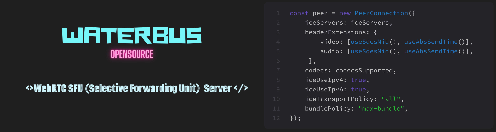

# Waterbus SFU Server



## Quick start

- Clone this repository

```bash
git clone 
```

- Install dependencies

```bash
npm install
```

or 

```bash
yarn
```

- Config .env

```bash
mv example.env .env
```

fill out your config in `.env`

- Start project

```bash
npm run start 
```